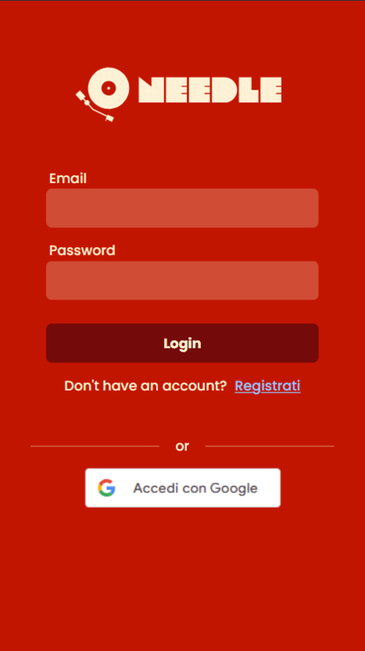
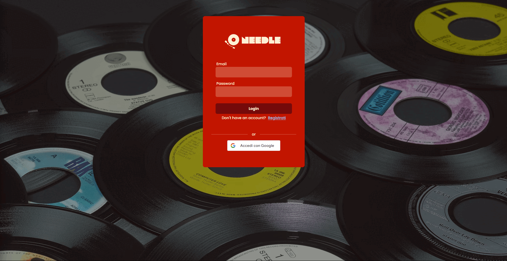

# Needle

<!-- TABLE OF CONTENTS -->
<details>
  <summary>Table of Contents</summary>
  <ol>
	<li>
	  <a href="#about-the-project">About The Project</a>
	</li>
	<ul>
	<li>
	  <a href="#technologies-used">Technologies Used</a>
	</li>
	<li>
	  <a href="#features">Features</a>
	</li>
	</ul>
	<li>
	  <a href="#getting-started">Getting Started</a>
	  <ul>
		<li><a href="#prerequisites">Prerequisites</a></li>
		<li><a href="#installation">Installation</a></li>
	  </ul>
	</li>
	<li><a href="#running-the-server">Running the server</a></li>
	<ul>
	  <li><a href="#development-mode">Development mode</a></li>
	  <li><a href="#production-mode">Production mode</a></li>
	</ul>
	<li><a href="#application-overview">Application overview</a></li>
	<ul>
	  <li><a href="#mobile-view">Mobile view</a></li>
	  <li><a href="#desktop-view">Desktop view</a></li>
	</ul>
  </ol>
</details>

<!-- ABOUT THE PROJECT -->

## About The Project

Needle is a Single Page Application (SPA) that allows you to create a virual collection of all your favorite records. It was born with the idea to keep track of your collection and implements also extra feature, like the generation of playlist directly on Spotify, starting from the albums you choose.
The name "Needle" itself is a pun, since it is indeed the little needle on turntable, but its pronunciation also recall the words "Need All", to express the wish of get them all.

### Technologies Used

- **TypeScript**
- **React**
- **Redux** for the State management
- **React Router** for the Navigation between pages
- **React Hook Form** for handling forms with validation
- **TailwindCSS** and **shadcn/ui** for the style

### Features

- **Search Albums**: Users can make search based on Album titles, Songs or Artists. Once you get your results, you can add records to your personal collection by clicking the bookmark icon or click on the heart icon to add them to your wish list.
- **Dashboard**: In the homepage, you can find some dashboard that give you further information about the composition of your virtual collection.
- **Playlist**: Once the collection is populated, you'll have access to the main feature of the application, namely the creation of playlist directly on your Spotify account. You will be presented with a page containing all the albums you collected, and will be able to to filter them by name, choose only the one you own, or the one in your wish list. After your selection is completed, you will also be able to exclude some of the tracks from the albums you want.

<p align="right">(<a href="#readme-top">back to top</a>)</p>

## Getting Started

### Prerequisites

- Ensure Node.js and npm are installed.

- Follow the setup instructions in the /server/README.md to ensure the backend is running.

### Installation

Before running the project in either development or production mode, you need to install the necessary packages.

```bash
npm install
```

<p align="right">(<a href="#readme-top">back to top</a>)</p>

## Running the Server

Before starting, ensure the backend server is running.

### **Development Mode**

Start the development server on [localhost:5173](http://localhost:5173) by running:

```bash
npm run dev
```

### **Production Mode**

To run the server in production mode, follow these steps:

Build the application with the following command:

```bash
npm run build
```

Start the production server on [localhost:5173](http://localhost:5173) by running:

```bash
npm run preview
```

<p align="right">(<a href="#readme-top">back to top</a>)</p>

## Application overview

The Application is completely responsive and can be used comfortably on mobile and larger screen.

### Mobile view



### Desktop view



<p align="right">(<a href="#readme-top">back to top</a>)</p>
